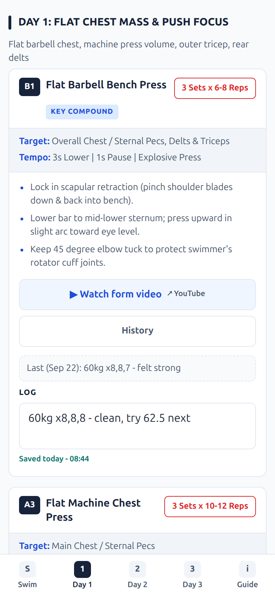
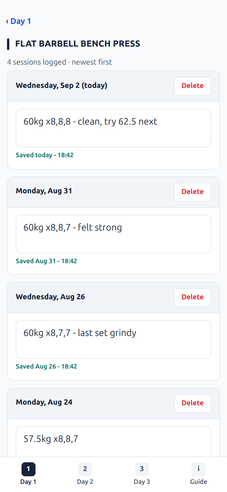

# Swim & Lift — Workout PWA

An offline-first workout app for a daily 2,500m swim and a three-day chest and arms programme. It installs to an Android home
screen, works with no signal in a basement gym, and keeps a free-text log of every set on the phone
itself — no account, no server, no sync.

Built as a personal training app, and kept public because the approach may be useful to anyone
building a small offline PWA without a framework.

| Workout | Per-exercise history |
| :--: | :--: |
|  |  |

## What it does

- **Works offline.** A service worker precaches the whole app; after one online visit it runs in
  airplane mode.
- **Installs like an app** — standalone window, no address bar, its own icon.
- **Free-text logging.** One box per exercise holding whatever you type: `60kg x8 / 62.5 x6 — last
  set grindy, keep 60 next week`. Never coerced into numbers, never rewritten.
- **Remembers your last session** above each box; tap it to copy it down. That one interaction is
  most of gym logging.
- **Per-exercise history** — every past session, editable and deletable.
- **Backup** to a JSON file and back, because the data lives in exactly one place.
- **Today's swim** on its own tab: the routine for this weekday, block by block, with lengths worked
  out for a 25m pool, plus a short Express set for busy days and a log for stroke counts.
- **Keeps the screen awake** while a workout is open, so the phone does not lock between sets.
- The programme itself — rules, post-swim fuel, cool-down, equipment-swapping matrix — is on a Guide tab,
  and written out in full in [docs/PROGRAM.md](docs/PROGRAM.md).

## Privacy

**Your log never leaves the device.** There is no backend, no account, and no analytics. This is
hosted on GitHub Pages, which is a *static* host: it can only send files out, and has no way to
receive or store anything. Even if the app wanted to upload your training data, there is nowhere for
it to go.

The consequence is worth understanding: your history exists on one phone only. Two devices would keep
two independent logs, and clearing the browser's site data would erase it — which is why the export
button exists.

## Stack, and why

**Vanilla JS (ES modules) + Vite. No framework, no runtime dependencies, no CDN.**

The app has exactly two interactive widgets — a text box and a link. React would have added a
build-and-runtime layer that bought nothing, and this has to open instantly on a cold phone in a
basement. It is about 1,000 lines of JavaScript plus 850 of CSS, and ships in **15 kB gzipped**.

The only runtime dependency is [`idb-keyval`](https://github.com/jakearchibald/idb-keyval) (~1 kB) to
take the ceremony out of IndexedDB.

Everything else is deliberate too:

- **Bundled `program.json`** rather than a runtime fetch — no request on the critical path.
- **Hand-rolled service worker** (~50 lines, generated at build time by a small Vite plugin). The
  precache list is nine files; Workbox would have been more machinery than the problem.
- **External video links, not local clips.** Linking avoids re-hosting other people's footage. It is
  the one feature that needs signal, and it says so when you are offline.
- **No `skipWaiting()`** — a new version activates on the next cold start, never swapping assets
  mid-session.

## Running it

Requires Node 20.19+ or 22.12+.

```bash
npm ci
npm run dev      # http://localhost:5173
npm test         # 39 unit tests over the log/backup logic
npm run build    # production build into dist/
npm run preview  # serve the build — needed to exercise the service worker
```

The service worker only registers in a production build, so `npm run dev` is never shadowed by a
stale cache.

## Deploying your own

`.github/workflows/deploy.yml` builds on every push to `main`, runs the tests, and publishes to
GitHub Pages. To point it at your own repo:

1. Fork or copy it, then in **Settings → Pages** set **Source: GitHub Actions**
2. Push to `main`

`vite.config.js` sets `base: './'`, so it works unchanged from a project subpath such as
`https://<user>.github.io/<repo>/`.

## Making it your own programme

`program.json` is the single read-only source of truth — exercises, sets, rep ranges, cues, the
weekly protocol and the colour palette. The app never writes to it; you change the programme by
editing that file and redeploying. `media.json` maps each exercise code to a reference video URL.

The full contract is documented in **[docs/DATA.md](docs/DATA.md)**.

## Layout

```
program.json          the programme (read-only)
media.json            exercise code -> video URL
src/
  main.js             boot, hash router, event delegation
  program.js          load + validate program.json
  logs.js  db.js      IndexedDB log storage, backup, history
  wake-lock.js        keep the screen on during a workout
  views/              workout.js, guide.js, history.js
  components/         exercise-card, log-field, tab-bar, data-tools
docs/
  DATA.md             program.json schema
  ORIGINAL-SPEC.md    the original brief (historical)
tools/make-icons.py   regenerates the PWA icons
```

Conventions and the reasoning behind the sharper edges are in **[CLAUDE.md](CLAUDE.md)**.

## Health disclaimer

This is one person's training programme, written for a specific 56-year-old swimmer with particular
joint considerations. **It is not general fitness advice**, it has not been reviewed by any medical
or coaching professional, and the loads, rep ranges and exercise selection may be entirely wrong for
you. Talk to a qualified professional before following any of it. Use at your own risk.

## Licence

[MIT](LICENSE).

Exercise reference videos are **linked**, not redistributed; each remains the property of its
original creator.
